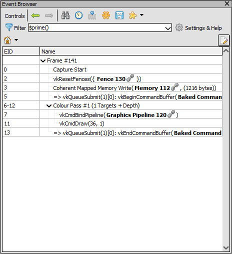
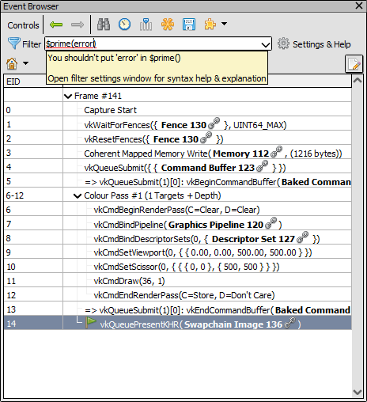
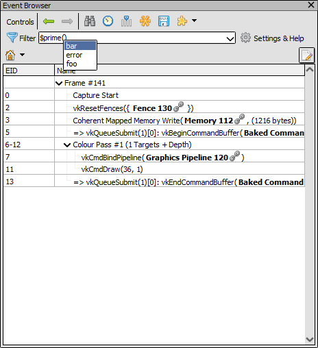

Example: Adding a custom event browser filter
=============================================

The event browser allows a :doc:`filter expression <../../how/how_filter_events>` which can determine which events are shown and which aren't, defaulting to showing all :ref:`action events <actions>`.

The builtin filters allow filtering by simple strings but also by things like function parameters, parents/children for markers, or by regular expressions. Each special filter can have parameters to e.g. show all draws with more than 1000 indices with ``$action(numIndices > 1000)``.

It is possible to write a custom filter in python, allowing you to implement arbitrarily complex logic. This would best be done as a :doc:`UI extension <../ui_extensions>` so the filter is registered persistently, but we will demonstrate this with a simple script.

Registration
------------

To begin with, we need to register our filter. We provide the function name, which for us is ``prime`` meaning the filter will be ``$prime(...)``, as well as a description text that will be shown in the help window for users.

In this example, we unconditionally unregister the filter first to ensure that the registration succeeds. Normally in a UI extension you would register and unregister in the corresponding extension functions.

.. highlight:: python
.. code:: python
    
    pyrenderdoc.GetEventBrowser().UnregisterEventFilterFunction("prime")
    pyrenderdoc.GetEventBrowser().RegisterEventFilterFunction(
        "prime",
        "Show only events with prime EIDs.",
        filter_func,
        parser_func,
        completer_func,
    )

We provide three callback functions, one for doing the actual filtering, one for parsing parameters, and one for auto-complete. Only the filtering function is required, so if you don't need any parameters you can pass ``None`` for the parser and completer functions.

Filtering
---------

The filter function is called once for each candidate event and returns a ``bool`` indicating whether this event should be included or excluded. The function is passed a few parameters directly for the event which are useful. You are given the :class:`~qrenderdoc.CaptureContext` again for any queries needed, as well as the name of your filter (in case you have a multi-dispatch function) and the parameters passed.

Per event you are also given the :ref:`event ID <eventids>`, the :class:`~renderdoc.SDChunk` for looking up :ref:`API parameters <apiparams>`, the :class:`~renderdoc.ActionDescription` for actions (or ``None`` if the event is not an action), and a string  name that is shown in the event browser.

Our extremely useful filter function just checks to see if the EID is prime or not.

.. highlight:: python
.. code:: python
    
    # prime numbers have exactly 2 integer factors.
    # note the // operator in python does integer-division
    def isprime(n):
        return len([x for x in range(1, n + 1) if (n / x) == (n // x)]) == 2

    def filter_func(
        ctx: qrenderdoc.CaptureContext,
        filter: str,
        params: str,
        eventId: int,
        chunk: renderdoc.SDChunk,
        action: renderdoc.ActionDescription,
        eventName: str,
    ):
        return isprime(eventId)

    Our filter showing the prime events

Parsing
-------

Optionally filter functions can take parameters. There is no strict rule to what the parameter string must be, but users will likely expect it to look like an expression. You are responsible for parsing the string yourself, which you can do in this function.

This function is called once whenever the filter changes, and so can also be a good time to cache more expensive data rather than repeatedly re-calculating something in the filter function.

The function should return a string with any errors it wants to report - or an empty string if there are none. If errors are reported the filter won't be evaluated and the errors will be highlighted to the user.

In our case we simply look for the string 'error' and disallow that.

.. highlight:: python
.. code:: python
   
    def parser_func(ctx: qrenderdoc.CaptureContext, filter: str, params: str):
        if "error" in params:
            return f"You shouldn't put 'error' in ${filter}()"
        return ""

    The parser showing an error for our filter 

Auto-complete
-------------

Going hand-in-hand with parsing arguments, it is also optionally possible to provide auto-complete suggestions for users. These suggestions are not fixed and can be done contextually based on the current (partial) parameters string.

Even if you have a parsing function, the auto-completion function is optional so you can omit it.

In our example we just return a fixed set of strings, including an error string which shows off our parsing.

.. highlight:: python
.. code:: python
        
    def completer_func(ctx: qrenderdoc.CaptureContext, filter: str, params: str):
        return ["foo", "bar", "error"]

    The auto-complete options for our filter

Example Source
--------------

This example can be found under the name "Custom event filter" in the python scripting window.

.. only:: html and not htmlhelp

    :download:`Download the example script <event_filter.py>`.

.. literalinclude:: event_filter.py