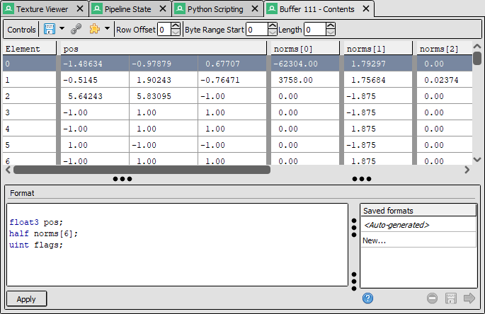

Example: Show buffer with format
================================

This example shows how to fetch the information and contents of a buffer, as well as opening up a view of it in the UI.

This could for example be run as a command line argument when starting the UI, to avoid repetitive steps or automate a repro case.

Fetching Buffer Metadata
------------------------

First we iterate through the list of buffers (:meth:`~qrenderdoc.CaptureContext.GetBuffers`) to find the one we want. The selection criteria would be up to you, in this case we look at the buffer's name (:meth:`~qrenderdoc.CaptureContext.GetResourceName`) and choose a buffer using that - however it could also be a particular size, or the buffer :doc:`bound to a shader <shader_refl>` at a given event. To keep the example flexible we will default to using the last buffer in the list if one doesn't match the criteria.

.. tip::

    If you already have the :ref:`Resource ID <resourceids>` of the buffer you want, you can use :meth:`~qrenderdoc.CaptureContext.GetBuffer` to fetch the descriptor for it.

.. highlight:: python
.. code:: python

    mybuf = renderdoc.ResourceId.Null()

    for buf in pyrenderdoc.GetBuffers():
        print(f"buf {buf.resourceId} is {pyrenderdoc.GetResourceName(buf.resourceId)}")

        mybuf = buf.resourceId

        # here put your actual selection criteria - i.e. look for a particular name
        if "Vertex" in pyrenderdoc.GetResourceName(buf.resourceId):
            break

    print(f"selected {pyrenderdoc.GetResourceName(mybuf)}")

Opening Buffer Viewer
---------------------

Once we've identified the buffer we want to view, we create a buffer viewer (:meth:`~qrenderdoc.CaptureContext.ViewBuffer`) and display it on the main tool area (:meth:`~qrenderdoc.CaptureContext.AddDockWindow`).

.. highlight:: python
.. code:: python

    formatter = """
    float3 pos;
    half norms[6];
    uint flags;
    """

    if mybuf != renderdoc.ResourceId.Null():
        # Open a new buffer viewer for this buffer, with the given format
        bufview = pyrenderdoc.ViewBuffer(0, 0, mybuf, formatter)

        # Show the buffer viewer on the main tool area
        pyrenderdoc.AddDockWindow(bufview.Widget(), qrenderdoc.DockReference.MainToolArea, None)

	The buffer viewer we opened for the buffer we chose.

Fetching Buffer Contents
------------------------

Lastly we'll go a step further and fetch the buffer data (:meth:`~renderdoc.ReplayController.GetBufferData`) ourselves to print the first 8 bytes. To access this we will need to obtain the :class:`~renderdoc.ReplayController` which controls RenderDoc's underlying analysis.

For convenience we will fetch a blocking version (:meth:`~qrenderdoc.CaptureContext.GetBlockingController`) that stalls the python script and executes the given command. If this code ran in a UI extension that could cause the UI to become unresponsive while the buffer data is fetched so this work could be done on a thread instead - see :ref:`pythreading`.

.. note::
    As with most data retrieved from RenderDoc, this buffer data is relative to the :ref:`current event <currentevent>` - the same as if a buffer viewer is opened in the UI. Changing to a different current event may mean different data is fetched and printed.

With the replay controller we can request a given byte range by its offset and length. If we wanted to get the whole buffer we could specify a length of 0. This is returned as a python ``bytes`` object which encapsulates a raw byte sequence, and ``struct.unpack_from`` is a python function that interprets bytes into values - see the `python documentation <https://docs.python.org/3/library/struct.html>`_ for how to write format strings to pull out floats and different byte-width values.

.. highlight:: python
.. code:: python

    controller = pyrenderdoc.GetBlockingController()

    data_bytes = controller.GetBufferData(mybuf, 0, 8)

    data_decoded = struct.unpack_from("8B", data_bytes)

    print(f"The first 8 bytes of the buffer are: {data_decoded}")

Final output from the script with this decoding:

.. sourcecode:: text

    buf ResourceId::111 is Buffer 111
    selected Buffer 111
    The first 8 bytes of the buffer are: (69, 64, 190, 191, 12, 146, 122, 191)

Example Source
--------------

This example can be found under the name "Show buffer with format" in the python scripting window.

.. only:: html and not htmlhelp

    :download:`Download the example script <show_buffer.py>`.

.. literalinclude:: show_buffer.py
