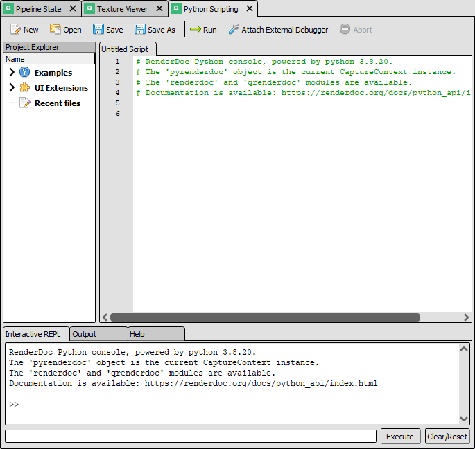

Tutorial: First Steps with Python
=================================

We will begin by writing a very simple script to run directly in the UI. To start with open the python scripting panel from :guilabel:`Window` → :guilabel:`Python Scripting`.

Python Scripting panel
----------------------

	The python shell when first opened

The main area is a script editor which allows you to write python code, load and save scripts, and run them.

On the left is a project explorer which shows recent files loaded, UI extensions (which will be detailed later) as well as a few pre-provided examples which can be loaded and run.

At the bottom is an interactive REPL (read-evaluate-print loop) which can run python one-liners interactively, as well as tabs that show text output & errors as well as help information.

Your first script
-----------------

To begin with you should open any capture, and we will run a very simple script on it.

The example code below can either be copy-pasted or you can type it out to see the autocomplete information as it goes. This is also available as ``Tutorial: First Steps with Python`` in the :guilabel:`Examples` section of the project explorer.

.. highlight:: python
.. literalinclude:: first_steps.py

You might get output like this in the output window when you click :guilabel:`Run`:

.. sourcecode:: text

    Currently we are at EID 9408 named: 'vkCmdDrawIndexed(123, 2)'
        > the previous event 9407 is named: 'vkCmdBindDescriptorSets(1, { Descriptor Set 692529 })'
    Output 0 is: 2D Color Attachment 690491
    Output 1 is: 2D Color Attachment 690493
    Output 2 is: 2D Color Attachment 690496
    Output 3 is: 2D Color Attachment 690498
    Output 4 is: 2D Color Attachment 690500

Breaking it down
----------------

When running scripts in RenderDoc's UI, there is a pre-filled global variable ``pyrenderdoc`` which is your entry point to the API access. This variable represents a :class:`~qrenderdoc.CaptureContext` that provides common data like the current event as well as handles to the available panels like the event browser.

First we can check that a capture is loaded, and if not prompt the user to give us one to open.

.. highlight:: python
.. code:: python

    if not pyrenderdoc.IsCaptureLoaded():
        filename = pyrenderdoc.Extensions().OpenFileName("Choose a capture", "", "*.rdc")

        pyrenderdoc.LoadCapture(filename, renderdoc.ReplayOptions(), filename, False, True)

From ``pyrenderdoc`` we can query the :ref:`current event ID <currentevent>` as an integer. With that :ref:`event ID <eventids>` we can fetch the :class:`~qrenderdoc.EventBrowser` from :meth:`~qrenderdoc.CaptureContext.GetEventBrowser` and use it to look up the formatted name of both the current and previous event with :meth:`~qrenderdoc.EventBrowser.GetEventName`.

.. highlight:: python
.. code:: python

    eid = pyrenderdoc.CurEvent()

    name = pyrenderdoc.GetEventBrowser().GetEventName(eid)

    print(f"Currently we are at EID {eid} named: '{name}'")
    if eid > 1:
        prevname = pyrenderdoc.GetEventBrowser().GetEventName(eid-1)
        print(f"    > the previous event {eid-1} is named: '{prevname}'")

After that we fetch the current :class:`~renderdoc.PipeState` from :meth:`~qrenderdoc.CaptureContext.CurPipelineState` which is an abstraction over a subset of the current pipeline state, which will work regardless of the API in the capture. This doesn't provide all possible states especially where there are differences between APIs but is convenient for simple uses.

From the pipeline state we get the list of color output targets with :meth:`~renderdoc.PipeState.GetOutputTargets`.

.. highlight:: python
.. code:: python

    pipe = pyrenderdoc.CurPipelineState()

    outputs = pipe.GetOutputTargets()

The list of outputs may contain unbound resources as some APIs have a fixed set of outputs which may be sparsely populated. We print all of the bound resources and skip any that are unbound, printing the names and indices of the rest via lookup of their :ref:`Resource ID <resourceids>`. For those unfamiliar with python, ``enumerate()`` is a built-in function that returns pairs of ``index, element`` for each element in a list or sequence.

.. highlight:: python
.. code:: python

    for idx, out in enumerate(outputs):
        if out.resource != renderdoc.ResourceId.Null():
            name = pyrenderdoc.GetResourceName(out.resource)
            print(f"Output {idx} is: {name}")

The ``print()`` statements get sent to the output panel, which will show itself if currently hidden when you run the script. If you hit any python exceptions they will also print to this output panel.

We can also separately show the depth target, if bound, using the same mechanism:

.. highlight:: python
.. code:: python

    depth = pipe.GetDepthTarget()

    name = pyrenderdoc.GetResourceName(depth.resource)
    print(f"Depth is: {name}")

.. note::

    It is safe to call ``sys.exit()`` to abort a script running, this will not close RenderDoc itself!

This tutorial will not exhaustively cover everything available in the :class:`pyrenderdoc <qrenderdoc.CaptureContext>` context. You are encouraged to browse the documentation or explore through autocomplete to see what is available.

Next steps
----------

This gives a *very* brief 5-minute intro to using python. You could now look at some more of the :doc:`examples/index` that give starting points for common workflows or pieces of analysis.

To move away from manually opening & running scripts next we will create a UI extension which is more convenient for day-to-day use.