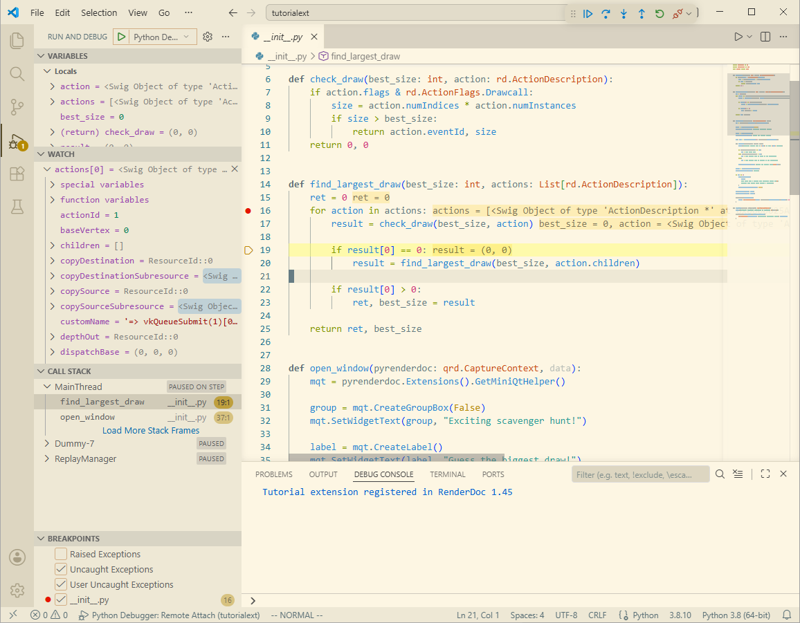
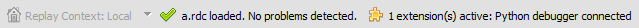

Python IDE integration
======================

RenderDoc supports integration with external editors, as RenderDoc is not as powerful or capable for python development as a dedicated IDE. With IDE integration it is also possible to set breakpoints and step-through debug python scripts as well which is not possible within RenderDoc.

For this tutorial we will use VS Code as it has the best integration with RenderDoc, but it is possible to use other tools such as PyCharm.

A screenshot of a VS Code debugging session, paused in the :doc:`tutorial UI extension <ui_extensions>`.

VS Code quick setup
-------------------

If you want to use `VS Code <https://code.visualstudio.com/>`_ with RenderDoc, it will work out of the box for simple code editing.

To use it for debugging python code and with fully-featured autocomplete, here are the extra setup steps needed.

#. Install the `pylance <https://marketplace.visualstudio.com/items?itemName=ms-python.vscode-pylance>`_ and `debugpy <https://marketplace.visualstudio.com/items?itemName=ms-python.debugpy>`_ extensions if you don't have them already. These are automatically installed by the default `python <https://marketplace.visualstudio.com/items?itemName=ms-python.python>`_ meta-extension.
#. Open the settings window (:kbd:`Ctrl-,`) to modify these settings:
#. Add the RenderDoc stubs folder to :abbr:`Extensions → PyLance → Extra Paths (python.analysis.extraPaths)` (``@id:python.analysis.extraPaths``).

   On Windows this is ``%APPDATA%\qrenderdoc\pystubs\latest`` and on linux it's ``~/.local/share/qrenderdoc/pystubs/latest``.
#. Disable the :abbr:`Extensions → Python Debugger → Just my code (debugpy.debugJustMyCode)` (``@id:debugpy.debugJustMyCode``) setting.
#. Enable the :abbr:`Features → Tasks → Allow Automatic Tasks (task.allowAutomaticTasks)` (``@id:task.allowAutomaticTasks``) setting (optional).
#. When actively debugging, enable ``Breakpoints →  User Uncaught Exceptions`` at the bottom of the ``Run and Debug`` sidebar.

If you just installed the debugging extensions, you will have to restart the RenderDoc UI for them to be found. After this you can use the :guilabel:`Attach External Debugger` button in the python scripting panel to debug python code, with full autocomplete in VS Code. In the VS Code settings JSON this looks like so:

.. highlight:: json
.. code:: json

    {
        "python.analysis.extraPaths": [
            "C:\\users\\baldurk\\appdata\\roaming\\qrenderdoc\\pystubs\\latest"
        ],
        "debugpy.debugJustMyCode": false,
        "task.allowAutomaticTasks": "on"
    }

.. _pystubs:

Python Stubs
------------

Python modules written in C like RenderDoc's can't have type annotations that are key to providing good autocomplete in an IDE. The standard alternative is to provide python 'stub' files which are written in pure python and have no implementations, only signatures and other type annotations.

RenderDoc generates appropriate stubs within your application data directory with one per version as well as a rolling 'latest' version. On Windows this is :file:`%APPDATA%\qrenderdoc\pystubs` and on linux it's :file:`~/.local/share/qrenderdoc/pystubs`.

Typically you can use the ``latest`` version without problems, but if you are targeting a specific version of RenderDoc you can use one of the versioned directories.

In VS Code to enable the use of stubs, add this folder to the ``python.analysis.extraPaths`` setting which can be found at ``Python → Analysis: Extra Paths`` in the VS Code UI. For other editors consult your editor's documentation for how to add extra stubs paths for typechecking and autocomplete.

After doing this any python scripts that import the ``renderdoc`` or ``qrenderdoc`` modules should have proper autocomplete.

Python Debugging
----------------

RenderDoc supports integration with `debugpy library <https://github.com/microsoft/debugpy>`_, a common remote debugging toolkit that allows external debuggers or IDEs to connect and debug python code running within the RenderDoc UI.

If you have VS Code installed in the standard location, and have the `ms-python.debugpy <https://marketplace.visualstudio.com/items?itemName=ms-python.debugpy>`_ extension installed, RenderDoc will automatically load and initialise ``debugpy`` on first startup. It will also try to load ``debugpy`` from PyCharm's installation if VS Code can't be found, or you can specify a custom path to where ``debugpy`` should be loaded.

If you have just installed these extensions, you will need to restart RenderDoc to initialise it.

.. note::
    If building RenderDoc from source you will build against Python 3.6 which does not support debugging. Customise your local build to :ref:`use a newer version of Python <custom-py-ver>` or use one of the official releases which uses Python 3.8.

Once ``debugpy`` has been loaded, the debugger is listening on the default local port ``5678``. Within VS Code or your IDE you can configure what may be called a 'remote attach' or 'debug server attach' connecting to ``localhost`` on port ``5678``.

If RenderDoc has detected your installation of VS Code it also provides convenient ways to debug UI extensions and scripts. In a python script you have written you can press the :guilabel:`Attach External Debugger` button. This will automatically try to launch VS Code with the necessary environment to connect a debugger. If you enable the ``Allow Automatic Tasks`` option in VS Code's settings it will automatically connect to the debugger on startup, otherwise you will have to choose to start debugging in order to connect.

	The status bar showing that a python debugger is connected.

.. important::
    Due to a quirk of how the python integration works in RenderDoc, VS Code may consider scripts as not being contained properly within a project. It is strongly recommend that you **disable** the ``Just my code`` option under the ``debugpy`` extension.

    You may also need to check the ``User Uncaught Exceptions`` setting under ``Breakpoints`` to properly trap exceptions that are thrown in the python code, as otherwise RenderDoc will catch them itself for display.

.. warning::
    By default, RenderDoc creates a :file:`.vscode` folder and :file:`launch.json` configuring the debugging setup for attaching, but it will not overwrite an existing file. Be warned that VS Code's default remote attach configuration contains "path mappings" which can cause RenderDoc debugging to not function correctly, since remote attach is normally not used on the same folder. It is strongly recommended you delete any path mappings and restart RenderDoc & VS Code if you have already tried to attach.

Debugging workflow
------------------

When using an external python debugger such as VS Code, it can be attached to the RenderDoc UI at any time as long as RenderDoc has detected or been configured for the appropriate ``debugpy`` module. Attaching must be initiated from the IDE side and can't be started from RenderDoc - the attach debugger button within RenderDoc's UI only launches the IDE and possibly triggers it to attach immediately, but is not necessary if you already have your IDE open.

When attached, the external debugger will debug all python code in RenderDoc even if it has a project open that only contains e.g. one script or one UI extension. You can reattach at any time from the relevant project, with nothing needed on the RenderDoc side.

RenderDoc's python debugger connection is singleton though so only one IDE/debugger can be attached at a time, and only the first instance of the UI to start will be available to connect to.

Next steps
----------

You should now have a good setup for writing and debugging python code using RenderDoc's modules, as well as a starting point for writing scripts and UI extensions.

If you have a specific task in mind you can explore the API, you may want to consult the :doc:`examples/index` which show how to do several simple tasks and demonstrate the use of :class:`~renderdoc.ReplayController` which is the main entry point for the underlying API and most of the possible power that RenderDoc exposes.

If you are writing more complex scripts you may want to see :doc:`in_depth/index` which have more detailed explanations of particular topics or things to bear in mind.

There is also a :doc:`faq` which addresses some common issues or stumbling blocks.