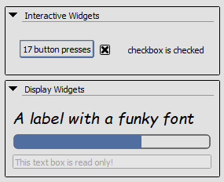

Mini-Qt Helper
==============

By default RenderDoc ships with PySide-provided Qt bindings to allow users in UI extensions access to the Qt API for creating their own UIs.

The full Qt UI has a fair amount of complexity though that is outside the scope of this documentation, and may be inconvenient for small or quick UIs. For that reason RenderDoc itself provides a limited simplified API for creating UI elements - :class:`~qrenderdoc.MiniQtHelper`.

.. note::
    Although intended for only interacting with user-created UI elements, the helper does use the normal Qt API internally which means there is no distinction made between user-created widgets and the baseline widgets in the RenderDoc UI itself.

    Care should be taken for any interactions like this as it is possible to modify or interact with the normal UI through this helper.

Creating widgets
----------------

Qt is a declarative UI system, you create widgets in a hierarchy with layout information. RenderDoc's docking system allows you to create a top-level widget that becomes docked as a panel, and then you have full control over the contents of the panel which can be changed dynamically.

Creating a top-level widget is done with :meth:`~qrenderdoc.MiniQtHelper.CreateToplevelWidget`. This function takes a string for the window title of the panel as well as an optional :func:`~qrenderdoc.MiniQtHelper.WidgetCallback` that will be called if the top level widget is closed.

A number of standard interactive or display widget types are available, each with its own properties:

- :meth:`~qrenderdoc.MiniQtHelper.CreateButton`
- :meth:`~qrenderdoc.MiniQtHelper.CreateCheckbox`
- :meth:`~qrenderdoc.MiniQtHelper.CreateComboBox`
- :meth:`~qrenderdoc.MiniQtHelper.CreateRadiobox`
- :meth:`~qrenderdoc.MiniQtHelper.CreateLabel`
- :meth:`~qrenderdoc.MiniQtHelper.CreateProgressBar`
- :meth:`~qrenderdoc.MiniQtHelper.CreateSpinbox`
- :meth:`~qrenderdoc.MiniQtHelper.CreateTextBox`

Interactive widgets can take a :ref:`callback <widget-callback>` for when they are changed or interacted with, as well as the ones with state having queries to fetch their state.

These functions return a handle to the widget, which is owned by python but has an explicit lifetime. A top-level panel that is closed by the user or by :meth:`~qrenderdoc.MiniQtHelper.CloseToplevelWidget` will automatically destroy all of its children recursively, which is the common way to handle :doc:`lifetimes <lifetimes>` as long as all widgets have been added. You should be careful not to access any lingering widget handles after they may have been closed as they are no longer valid.

If a widget is not currently attached anywhere it must be destroyed explicitly with :meth:`~qrenderdoc.MiniQtHelper.DestroyWidget`, which similarly will destroy any of its children.

Widget layouts
--------------

Widgets can't be placed freely using this API, but instead are laid out in one of three ways that adjust to the size of the available space:

#. In a vertical container where widgets are added in order, with :meth:`~qrenderdoc.MiniQtHelper.CreateVerticalContainer`.
#. In a horizontal container where widgets are added in order, with :meth:`~qrenderdoc.MiniQtHelper.CreateHorizontalContainer`.
#. In a grid container where widgets are placed in 2D cells, with :meth:`~qrenderdoc.MiniQtHelper.CreateGridContainer`.

These containers can be used recursively to create more complex UI layouts. By default widgets will either remain a fixed size where it makes sense (e.g. for buttons or checkboxes) and expand to fill available space (e.g. text boxes).

Widgets are added to these containers with :meth:`~qrenderdoc.MiniQtHelper.AddWidget` and :meth:`~qrenderdoc.MiniQtHelper.InsertWidget` for vertical or horizontal containers, and :meth:`~qrenderdoc.MiniQtHelper.AddGridWidget` for grid containers.

Widgets can't be removed individually but can be removed all at once using :meth:`~qrenderdoc.MiniQtHelper.ClearContainedWidgets`. You can query for the current set of children with :meth:`~qrenderdoc.MiniQtHelper.GetNumChildren` and :meth:`~qrenderdoc.MiniQtHelper.GetChild`.

By default widgets that can contain others have an implicit vertical container - these include top level widgets created with :meth:`~qrenderdoc.MiniQtHelper.CreateToplevelWidget` and group boxes created with :meth:`~qrenderdoc.MiniQtHelper.CreateGroupBox`.

Widget properties
-----------------

Most widgets have some kind of state associated, for example a label or button has its text contents, a checkbox has a flag of whether it's on or off, etc. 

Although not listed exhaustively here, functions to both query and set these states are provided. Most functions are generic and will apply to many different widgets - for example :meth:`~qrenderdoc.MiniQtHelper.SetWidgetText` will set the widget's "text" property, but that will mean different things depending on the widget. For a label this directly sets the text content of the label, but for example on a group box or top-level widget it sets the title.

This can also be used to query for or set the state of user-interactive elements such as checkboxes with :meth:`~qrenderdoc.MiniQtHelper.IsWidgetChecked` or :meth:`~qrenderdoc.MiniQtHelper.SetWidgetChecked`. If called on an invalid widget these queries will return empty data and the setters will do nothing.

Some general widget properties can also be set here, such as with :meth:`~qrenderdoc.MiniQtHelper.SetWidgetFont` to change the font of a widget including bold or italic, or :meth:`~qrenderdoc.MiniQtHelper.SetWidgetVisible` and :meth:`~qrenderdoc.MiniQtHelper.SetWidgetEnabled` which can show/hide or enable/disable widgets respectively.

.. _widget-callback:

Widget callbacks
----------------

A number of functions offer a callback when some event happens, such as a widget being pressed or changed. Each of these places uses the same form of callback:

.. highlight:: python
.. code:: python

    def WidgetCallback(context: qrenderdoc.CaptureContext, widget: QWidget, text: str):
        ...

The first parameter is the same :class:`~qrenderdoc.CaptureContext` as is available elsewhere, with the widget being the one emitting the event. The text parameter is contextually relevant and depends on the exact event, but could provide the current or selected text for example.

Widget callbacks are optional, and do not have to be provided, but note that it is not currently possible to add or remove callbacks after widget creation.

Example and Conclusion
----------------------

A simple example can be found under the name "Mini-Qt UI" in the python scripting window.

.. only:: html and not htmlhelp

    :download:`Download the example script <../examples/miniqt_ui.py>`.

.. literalinclude:: ../examples/miniqt_ui.py

    The window produced by the example.

This is not an exhaustive API reference listing all possible pieces of functionality, you are encouraged to look at the :class:`~qrenderdoc.MiniQtHelper` documentation for the full list of features available.

This API does not allow you to create complex and highly controlled UIs, but for simple interfaces to allow for control and display of data it gives a quick way to create those UIs.