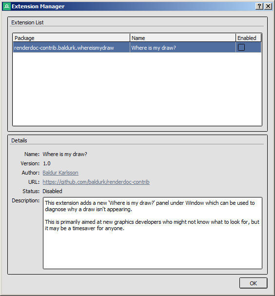
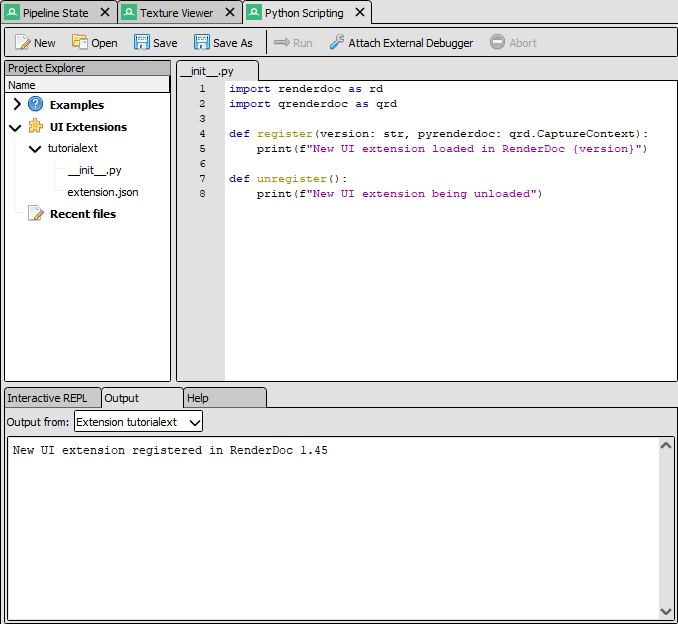
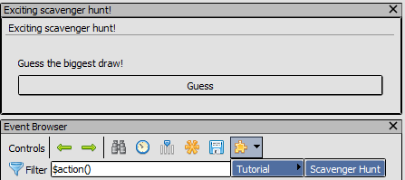

Tutorial: UI extensions
=======================

This document outlines how to get started writing a UI extension.

Creating an extension
---------------------

RenderDoc UI extensions are python modules loaded from standard locations on disk, depending on your platform. On Windows it's :file:`%APPDATA%\\qrenderdoc\\extensions` and on linux it's ``~/.local/share/qrenderdoc/extensions``.

In any subdirectory under this path you can register an extension by creating a ``extension.json`` file with some metadata, and creating a python module starting with an ``__init__.py`` file.

	Extension Manager: Configures installed extensions.

To streamline setup we will ask RenderDoc to create a new extension for us. Open the python scripting window from :guilabel:`Window` → :guilabel:`Python Scripting`. Then either double click the :guilabel:`Create New...` item under the :guilabel:`UI Extensions` section, or right click on the section title and select the option from the context menu.

From the dialog that appears enter a package name such as ``tutorialext``. This will create the ``extension.json`` and ``__init__.py`` files in a new folder ``tutorialext`` for us.

For more information about the registration of python extensions see :doc:`../how/how_python_extension`

Enabling the extension
----------------------

To load the extension, tick the :guilabel:`Enable` checkbox for its entry the extension manager. Python modules can't be unloaded but they can be reloaded if changes are made to the files on disk, which can be done from the :doc:`python scripting <../window/python_scripting>` window or the status bar.

Editing your extension
----------------------

At this point you will have an ``extension.json`` and ``__init__.py`` in the ``extensions/tutorialext`` folder in your application data directory. These can be edited in the program of your choice, but we will use the python scripting window which can browse and open extension files for edit.

In the python scripting panel project sidebar, expand :guilabel:`UI Extensions` and :guilabel:`tutorialext` to open these two files and see the default-provided contents.

	Python Scripting: Editing the files for a new UI extension.

We will add a UI button and new panel to demonstrate how UI extensions can provide user-interactive features. This is available as ``Tutorial: UI extension`` in the :guilabel:`Examples` section of the project explorer, though note that you will have to copy the code into your ``__init__.py`` as the example does not run on its own.

.. highlight:: python
.. literalinclude:: ui_extensions.py

If you edit the ``__init__.py`` you'll find that the RenderDoc status bar will notify you that as well as having one extension currently loaded the files have been changed on disk. Clicking the button in the status bar will reload the extension:

	The RenderDoc status bar with a modified extension loaded

After the extension has been reloaded, you can use the new extension menu item under the extension icon |plugin| in the event browser. The menu item  will open a new panel with a scavenger hunt for the largest drawcall in your capture.

	The new button and window added by the extension.

Breaking it down
----------------

This example demonstrates how you can bridge the gap between python scripts and UI elements. It shows how to add a menu item to one of the main interfaces - the event browser - and how to create a new UI panel with custom interactivity.

When our extension is loaded (or reloaded) the ``register()`` function we define is called with two parameters, the version of RenderDoc as a string e.g. ``"1.23"`` and the :class:`~qrenderdoc.CaptureContext` which is also available as a global ``pyrenderdoc``.

From the :class:`~qrenderdoc.CaptureContext` at ``pyrenderdoc`` that we used in the previous example, we can get access to :class:`~qrenderdoc.ExtensionManager` which gives us the option to create a UI. First we register a menu item (:meth:`~qrenderdoc.ExtensionManager.RegisterPanelMenu`) in the event browser's toolbar, providing a list of submenus and a callback to call when it is pressed.

.. tip::

	There are multiple places where you can add a new menu item, explore the available enum values and functions here to see what options there are!

When the ``open_window`` callback is called, we create a new window using the :doc:`UI helpers <in_depth/miniqt>` in :class:`~qrenderdoc.MiniQtHelper`. Note that most RenderDoc builds ship with fully integrated python Qt access via PySide, but the full Qt API is quite complex and not necessary for simple quick UIs.

For the UI we create a groupbox with a label and a button. When the button is pressed, it updates the label based on where the :ref:`current event <currentevent>` is relative to the largest drawcall found in the capture. This is all contained within a top-level widget (:meth:`~qrenderdoc.MiniQtHelper.CreateToplevelWidget`)

Finally we use :meth:`~qrenderdoc.CaptureContext.AddDockWindow` to add the top-level widget into RenderDoc's docking system. Any widget can be added as a new top-level docking panel, but it is recommended that you use an explicit top-level widget to be able to use its callback when it is closed.

Next steps
----------

This shows how to expose user-visible tools to connect through to custom scripts which can be of varying complexity. At this point you hopefully have the starting point to begin exploring APIs available in the documentation or through autocomplete.

Up until now we have written everything within the RenderDoc UI to get started quickly. This is fine for writing small snippets of code, but we can also set up an external IDE for a better experience when writing larger or more complex extensions.