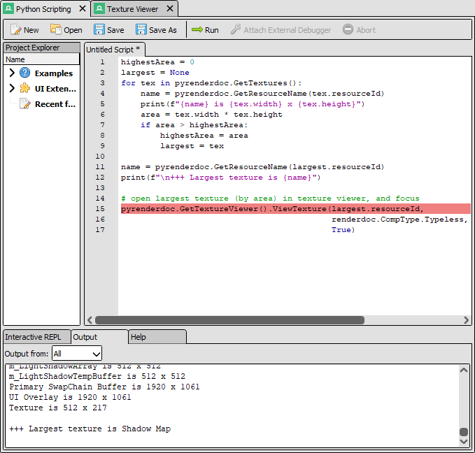

Python Scripting
================

The python scripting panel allows the management of python scripts and extensions.

Overview
--------

	The python shell

You can open the python scripting panel from the window menu. It offers both an interactive ``REPL`` and a window that can open, edit, and run scripts & UI extensions. The editor has limited auto-complete and error checking, though for complex scripts editing in an external IDE is recommended.

Examples
--------

A number of included example scripts are included for running to demonstrate use of the python APIs that RenderDoc exposes. Opening any of these example scripts will create a new temporary tab with the contents of the example script, but they will not be saved to disk.

UI extensions
-------------

UI extensions that are enumerated by RenderDoc will be listed with all python and markdown files as well as :file:`extension.json`, for editing within RenderDoc.

Right clicking on a UI extension can offer additional management options like enabling or reloading an extension, or revealing it in the file explorer.

Output
------

The output from python scripting is visible in this panel, and can either be shown from all possible sources or filtered to a particular source - e.g. only the output from the running script, or a particular UI extension.

Python documentation
--------------------

The full :doc:`python API <../python_api/index>` documentation contains a guide on how to get started with writing python scripts and UI extensions.

To get started the :code:`pyrenderdoc` object corresponds to a :class:`~qrenderdoc.CaptureContext` object through which the internal API and UI windows can be obtained.

For Qt integration, if available, you can import :code:`PySide2` which provides python bindings for the Qt API.

See Also
--------

* :doc:`../python_api/index`
* :doc:`../how/how_python_extension`
